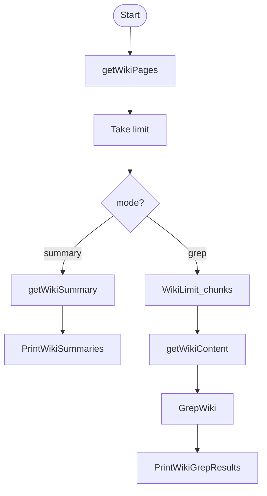

# concurrent-wiki-cli

A CLI experiment in building concurrent pipelines using Go.  
Fetches and processes Wikipedia search results in parallel, either by summary or body match (grep style).  
Built to practice channel pipelines, cancellation, and streaming data across goroutines.

### Features
- Streamed search using Wikipedia API
- Parallel fetching of page summaries and full text
- Custom "grep"-ish window extraction using word distance
- Configurable flags: word, search mode, word distance

### Notes
- Uses AI-generated printing functions.
- Logic redundancy: `Take` stage exists only to prototype bounded slicing.
- Hardcoded page limits and stages (intended for practice, not production).

### Example
```bash
go run . -word="panthera leo" -search=body -mode=grep -limit 1

=== Wikipedia Grep Results for: "panthera leo" ===

Binomial nomenclature (https://en.wikipedia.org/wiki/Binomial_nomenclature)
  PageID: 39736
  Matches found:
    - example of domesticus); -is, -is, -e (e.g., tristis, meaning "sad"); and -or -or -us (e.g., minor, meaning "smaller"). For further information, see Latin declension: Adjectives. The second part of a binomial may be a noun in the nominative case. An example is the binomial name of the lion, which is Panthera leo. Grammatically the noun is said to be in apposition to the genus name and the two nouns do not have to agree in gender; in this case, Panthera is feminine and leo is masculine. The second part of a binomial may be a noun in the genitive (possessive) case. The
    - part of the name was derived from a proper noun, e.g., the name of a person or place, a capital letter was used. Thus, the modern form Berberis darwinii was written as Berberis Darwinii. A capital was also used when the name is formed by two nouns in apposition, e.g., Panthera Leo or Centaurea Cyanus. In current usage, the second part is never written with an initial capital. When used with a common name, the scientific name often follows in parentheses, although this varies with publication. For example, "The house sparrow (Passer domesticus) is decreasing in Europe." The binomial name should generally
----------------------------------------------------
```

